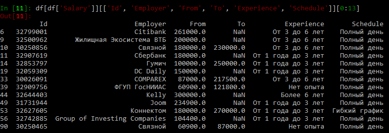

# Автоматизация поиска и исследования вакансий hh.ru

**Идея**: дабы не тратить время на поиск, анализ и исследование особенностей вакансий на hh.ru мне пришла мысль автоматизировать этот процесс с помощью `Python`.  Скрипт использует API hh.ru для доступа к данным вакансий.

### Общая информация

| **Title**     | HH Find & Research    |
| :-- | :-- |
| **Author**    | Alexander Kapitanov   |
| **Language**  | Python                |
| **Contact**   | sallador@bk.ru        |
| **Release**   | 14 Aug 2019           |
| **License**   | GNU GPL 3.0           |

____

### TODO:

Перечень неоконченых работ

1. Text statistics analyzer (наиболее встречающиеся слова в описании + фильтрация от предлогов, союзов и т.д)
2. Тоже самое, но для ключевых навыков
3. Тетрадка Jupyter Notebook для визуального отображения результатов
4. Графики

____

## Что умеет скрипт?
### Входные данные
Входные данные - словарь ключевых значений, формирующих запрос.

**Основные параметры**:
- `area` - локация поискового запроса (пример: `{area: 1}` - Москва),
- `text` - поисковой запрос для вакансий (пример: `{text : Machine Learning}` или `{text: Java}`),
- `per_page` - количество вакансий на страницу, по умолчанию **50**.
и другие параметры (в зависимости от требуемого запроса).

### Процесс
- Ответ от удаленного ресурса в виде json-массива для текущего курса валют: `{RUR, USD, EUR}`.
- На базе словаря **входных данных** формируется URL для запроса данных с hh.ru через API,
- Создается список всех `id` вакансий и сохраняется в файл (при повторном запуске файл нужно удалить!),
- Парсинг JSON в ответ на запрос по всем `id` вакансий,
    - Анализ параметра `salary` для формирования словаря зарплат:
        - Для зарплат, указанных в `USD` и `EUR` производится пересчёт по текущему курсу рубля,
        - Для зарплат, указанных до вычета НДФЛ производится пересчёт на реальную зарплату "на руки",
        - Для отсутствующих зарплат - пропуск.
    - Создаётся словарь ключевых элементов таблицы,
        - Массив содержит поля: `{колонки фрейма* -  (см. ниже)}`,
        - Для полей `From` и `To` происходит перерасчет зарплаты,
        - Ключевые навыки формируются как перечисляемый список,
        - Описание вакансий очищается от HTML-тегов с помощью дополнительной функции.
    - Функция возвращает массив кортежей.
- Преобразование сырых данных в `DataFrame` для дальнейшего анализа. Результат сохраняется на диск в виде `csv` файла.
- Анализ `DataFrame` - поиск статстических параметров, поиск мат. ожидания, медианы и т.д от зарплат. Классификация по параметрам
- Построение информативных графиков

**Колонки фрейма**:

| Параметр | Тип | Описание    |
| :-- | :-- | :-- |
| `Id`           | `str`    | идентификатор вакансии (формирует ссылку на вакансию) |
| `Employer`     | `str`    | работодатель |
| `Name`         | `str`    | название вакансии |
| `Salary`       | `bool`   | указание зарплаты: `True / False` |
| `From`         | `float`  | нижний порог зарплаты |
| `To`           | `float`  | верхний порог зарплаты |
| `Experience`   | `str`    | опыт работы |
| `Schedule`     | `str`    | график работы |
| `Keys`         | `list`   | ключевые навыки |
| `Description`  | `str`    | описание вакансиии |

*Нижний и верхний порог зарплаты пересчитаны в рубли по текущему курсу валюты. Также для зарплат, указанных до вычета НДФЛ производится пересчёт на реальную зарплату "на руки".*

### Выходные данные
Выходные данные - таблица в формате `csv`, созданная с помощью фреймворка `pandas`. Дополнительно к этой таблице проводится анализ: поиск мат. ожидания, медианы и т.д от зарплат в зависимости от остальных критериев в таблице (например, от опыта работы). Проводится классификация по различным параметрам.

| **Зависимости** |
| :-- |
| `re`           |
| `requests`     |
| `pandas`       |
| `tqdm`         |
| `matplotlib`   |

[Документация API HeadHunter hh.ru](https://github.com/hhru/api "Head-Hunter API documentation")
____

### Link:
  * https://habr.com/users/capitanov/

### Author:
  * Kapitanov Alexander

### Release:
  * 2019/08/14.

### License:
  * GNU GPL 3.0.
